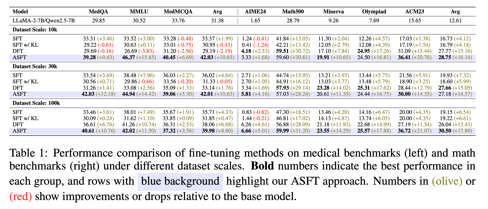
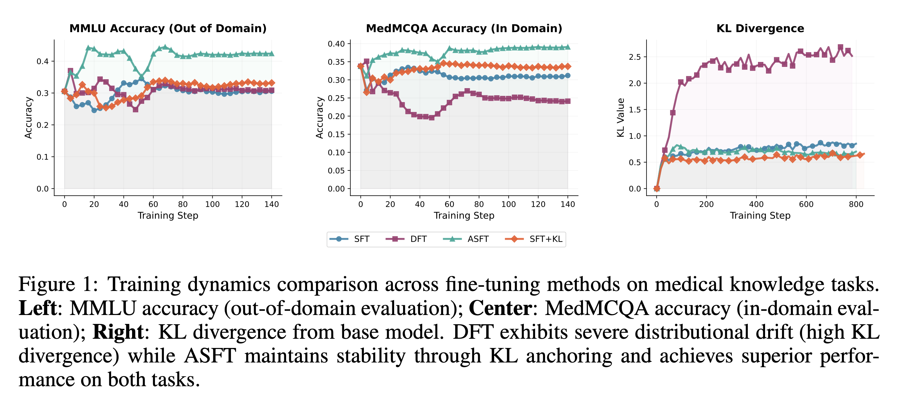
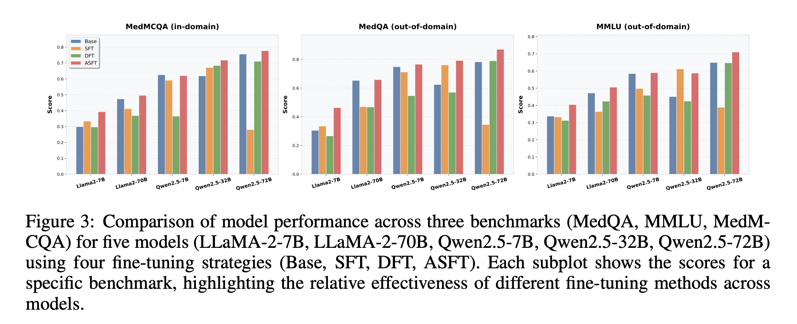

# Anchored Supervised Fine-Tuning (ASFT)

[](https://www.arxiv.org/abs/2509.23753)
*A principled and efficient post-training method for large language models*

## 👥 Authors

**He Zhu**¹*, **Junyou Su**¹*, **Peng Lai**², **Ren Ma**³, **Wenjia Zhang**¹, **Linyi Yang**², **Guanhua Chen**²†

¹Peking University
²Southern University of Science and Technology
³Shanghai Artificial Intelligence Laboratory

*Equal Contribution
†Corresponding Author

---

## 🚀 Introduction

Post-training large language models (LLMs) faces a trade-off:

* **Supervised Fine-Tuning (SFT)** is efficient but prone to memorization.
* **Reinforcement Learning (RL)** improves generalization but is costly and unstable.
* **Dynamic Fine-Tuning (DFT)** tightens the learning bound but suffers from **distributional drift** and instability.

👉 We propose **Anchored Supervised Fine-Tuning (ASFT)** — a lightweight extension of DFT that adds **KL anchoring**.
This ensures **tightness + stability**, combining the best of SFT and RL while keeping efficiency.

---

## 📰 News

**📄 2026-05-08**: Added a new **`verl` branch** — **recommended over the main (DeepSpeed-based) branch**. Several recent papers have identified precision issues with DeepSpeed; the `verl` branch uses **FSDP2**, which is more numerically stable for ASFT training.

**📄 2026-02-12**: ASFT has been merged into LLaMA-Factory main ([commit #10174](https://github.com/hiyouga/LLaMA-Factory/commit/675ce8cc7f70a65de403ccfd05195ca3ea6f3bd4)).  
Latest release is `v0.9.4`, so ASFT support is currently available on main and will be included in the next tagged release.

**📄 2026-01-30**: Accepted to ICLR 2026.

**📄 2026-01-23**: Added support for DeepSpeed and LoRA.

**📄 2025-09-28**: Released ASFT code and paper - [Paper](asft.pdf) | [Code](https://github.com/zhuchichi56/ASFT)

---

## ✨ Key Features

1. **Theoretical foundation**:

   * Formalized in the *Reward-Weighted Regression (RWR)* framework.
   * Proves DFT yields tighter RL lower bounds than SFT.
   * Identifies drift as the key weakness of DFT.

2. **Anchored stability**:

   * Adds a KL divergence regularization term to prevent drift.
   * Retains DFT’s advantages with controlled variance.

3. **Practical benefits**:

   * Minimal overhead compared to SFT.
   * Outperforms SFT, DFT, and iw-SFT across reasoning, medical, and code benchmarks.
   * Provides stronger initialization for RL methods like DAPO/GRPO. 

---

## 📊 Main Results

### Performance Comparison
<p align="center">
  
</p>

*Performance comparison of fine-tuning methods on medical and math benchmarks under different dataset scales. ASFT consistently outperforms other methods.*

### Training Dynamics
<p align="center">
  
</p>

*Training dynamics comparison showing ASFT maintains stability through KL anchoring while DFT exhibits severe distributional drift.*

### Cross-Model Performance
<p align="center">
  
</p>

*Comparison across different model architectures (LLaMA-2, Qwen2.5) demonstrating ASFT's consistent effectiveness across various model sizes and families.*

---

## 🔧 Usage

### Quick Start

#### 1. Installation

Clone the repository and install dependencies:

```bash
git clone https://github.com/zhuchichi56/ASFT.git
cd ASFT
conda create -n asft python=3.10
conda activate asft
pip install -r requirements.txt
```

If you need flash-attn (prebuilt wheel):

```bash
wget https://github.com/Dao-AILab/flash-attention/releases/download/v2.7.4.post1/flash_attn-2.7.4.post1+cu12torch2.4cxx11abiFALSE-cp310-cp310-linux_x86_64.whl
pip install flash_attn-2.7.4.post1+cu12torch2.4cxx11abiFALSE-cp310-cp310-linux_x86_64.whl
```

> Note: install a matching PyTorch build first (e.g., CUDA 12 + PyTorch 2.4) before installing flash-attn.

#### 2. Basic Training

Train an ASFT model with default settings (v2 supports more model families and multi-GPU training):

```bash
python train_v2.py \
    --model_name_or_path models/your-model \
    --mode asft \
    --data_path data/your-data.jsonl \
    --kl_weight 0.03 \
    --num_train_epochs 3 \
    --learning_rate 2e-5
```

DeepSpeed is supported via `--deepspeed_config` (Zero-2/Zero-3). Config files are in `scripts/` (e.g., `scripts/ds_zero2_bf16.json`). In practice, DeepSpeed Zero tends to be less stable; native (non-DeepSpeed) runs are the most stable overall. For example:

```bash
deepspeed --num_gpus 8 train_v2.py \
    --deepspeed_config scripts/ds_zero2_bf16.json \
    --model_name_or_path models/your-model \
    --mode asft \
    --data_path data/your-data.jsonl \
    --kl_weight 0.03 \
    --num_train_epochs 3 \
    --learning_rate 2e-5
```

> Note: For mixed precision (bf16/fp16), we recommend `kl_weight=0.03`. Larger KL weights amplify precision noise and can destabilize training, leading to degraded accuracy. Setting `0.03` keeps the KL anchor effective without over-regularizing under lower precision.

#### 3. LoRA (Recommended)

We recommend LoRA with `rank=8`, `lora_alpha=16`, `lora_dropout=0.05`, and **learning rate `5e-4`** for medical tasks. In our grid, `lr=5e-4, r=8` performs best on average and is noticeably stronger than `lr=2e-5` under the same rank.

Example (LoRA):

```bash
python train_v2.py \
    --model_name_or_path models/your-model \
    --mode asft \
    --data_path data/your-data.jsonl \
    --use_lora True \
    --lora_r 8 \
    --lora_alpha 16 \
    --lora_dropout 0.05 \
    --learning_rate 5e-4
```

Partial grid (Med, LLaMA2-7B):

| lr | rank | medqa | mmlu | medmcqa | avg |
|----|------|-------|------|---------|-----|
| 2.00E-05 | 8  | 0.3064 | 0.3366 | 0.3376 | 0.3269 |
| 5.00E-05 | 8  | 0.3299 | 0.3607 | 0.3464 | 0.3457 |
| 1.00E-04 | 8  | 0.3511 | 0.3896 | 0.3588 | 0.3665 |
| 2.00E-04 | 4  | 0.3692 | 0.4188 | 0.3717 | 0.3866 |
| 5.00E-04 | 8  | 0.3951 | 0.4147 | 0.3737 | 0.3945 |

#### 3. Evaluation

Evaluate trained models on various benchmarks. See `eval/README.md` for detailed steps and required inputs.

```bash
# AlpacaEval-style evaluation
python /volume/pt-train/users/wzhang/ghchen/zh/valid_code/ASFT-dev/eval/alpaca_eval_test.py

# Math evaluation
bash eval/math_evaluation/eval.sh

# Medical evaluation
python eval/medeval/vllm_medical_test.py
```


---

## 📦 Data Access

Large-scale training data is not stored in this repository. Please download it from the Hugging Face dataset repository:
`chichi56/ASFT`

You can also download all dataset files with the provided script:

```bash
python download_data.py --output_dir data
```

## 📚 Citation

If you find this work useful, please cite:

```bibtex
@misc{zhu2025anchoredsupervisedfinetuning,
      title={Anchored Supervised Fine-Tuning}, 
      author={He Zhu and Junyou Su and Peng Lai and Ren Ma and Wenjia Zhang and Linyi Yang and Guanhua Chen},
      year={2025},
      eprint={2509.23753},
      archivePrefix={arXiv},
      primaryClass={cs.LG},
      url={https://arxiv.org/abs/2509.23753}, 
}
```

---

## 🤝 Contributing

We welcome contributions! Please open issues or submit PRs for:

* Extending ASFT to new domains
* Improving training efficiency
* Adding evaluation benchmarks

---

## 🌟 Highlights

* **SFT efficiency + RL generalization**
* **Tighter theoretical guarantees**
* **Stable across tasks and scales**
* **Plug-and-play for LLaMA, Qwen, and more**

---
